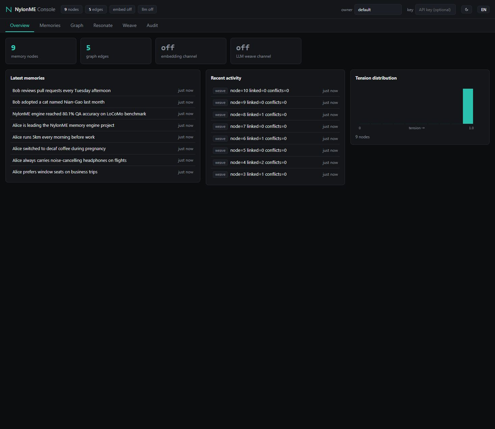

# NylonME — A Memory Engine for AI Agents

[简体中文](README.zh-CN.md) | English | [nylonme.com](https://www.nylonme.com)

> Single-node memory engine for AI agents: multi-filament memory weaving, mesh memory graph, tension-based forgetting, context resonance.
> Status: Phase 2 — active development (APIs may still evolve)

NylonME models each memory as a braid of multiple "filaments" (fact / emotion / temporal / relation / confidence / frequency), with memory nodes connected by weighted edges in a mesh graph rather than a hierarchy. Retrieval is not top-k similarity matching but **context resonance**: starting from seed nodes, activation spreads across the graph proportional to edge strength x context match x real-time tension, bounded by a global activation budget (so high-fan-out nodes cannot explode the traversal). Unused memories decay along a tension forgetting curve instead of piling up forever.

## Benchmark

LoCoMo evidence recall@10, full 10-session corpus (1536 answerable QA, lexical + vector hybrid retrieval):

| Stage | recall@10 |
|---|---|
| Lexical baseline | 47.1% |
| + vector seeds (bge-m3) + graph | 70.6% |
| + dual-layer write (leaf turns + session-level LLM facts) | 79.2% |
| + adaptive resonance depth (Cat4 single-hop queries skip diffusion) | 80.1% |
| + query-vector rerank of the activated set | 84.6% |
| + async commonsense reflection (world-knowledge bridges) | 85.4% |
| = re-baselined after write-side integrity fix (issue #1) | **85.9%** |

Per-category recall (full corpus): multi-hop 82.3%, temporal 88.8%, commonsense 58.7%, single-hop 89.1%.

End-to-end QA (LLM answers from the retrieved Top-10, judge-scored): paper protocol **80.1%** (Mem0 Appendix A wording), strict protocol **74.1%** — with an answer-side anti-abstention prompt (paired A/B on an identical weave: 76.4% → 80.1%; abstentions 163 → 76). Per-category J: multi-hop 68.6%, temporal 78.9%, commonsense 65.2%, single-hop 86.1%. Full method, per-category tables and variance notes in [docs/LOCOMO_BENCHMARK.md](docs/LOCOMO_BENCHMARK.md).

Two design rules the experiments forced on us: the **understanding layer lives on the write side** (the LLM is a compiler that turns raw events into retrievable structure; query-side LLM expansion measured net-zero), and **both layers must coexist** (abstract-layer-only retrieval drops the score to 67.3%).

## Use from Your Agent in 2 Minutes (MCP)

`nylon-engine mcp` speaks the Model Context Protocol over stdio with the engine **embedded** — no daemon, no ports; data lands in `~/.nylonme/data` automatically. Download a binary from [Releases](https://github.com/nylon-memory/NylonME/releases) and point your MCP client at it:

```json
{
  "mcpServers": {
    "nylonme": {
      "command": "/path/to/nylon-engine",
      "args": ["mcp"],
      "env": { "NYLON_OWNER": "my-project" }
    }
  }
}
```

Works with Claude Code, Cursor, Codex, VS Code Copilot and any MCP client. Your agent gets three tools: `memory_weave` (persist a fact), `memory_resonate` (recall related memories), `memory_get` (read a node). See [docs/GETTING_STARTED.md](docs/GETTING_STARTED.md) for per-client setup.

To share one memory store across machines, use optional **remote bridge mode**: set `NYLON_SERVER=host:50051` (optionally `NYLON_API_KEY`); MCP calls are forwarded to the remote engine and no engine is embedded locally.

### Turnkey memory for DSH (DeepSeek Harness)

The repo ships a DSH plugin that gives every DSH session automatic long-term memory (resonate at session start, weave at session end, zero binaries on the client):

```bash
dsh plugin --profile web add <nylon/plugins/dsh-nylonme-memory>
```

See [plugins/dsh-nylonme-memory/README.md](plugins/dsh-nylonme-memory/README.md).

## Web Console (built-in)

The engine binary also serves a zero-install web console and REST API (default `http://127.0.0.1:50052`, `NYLON_HTTP_ADDR=off` disables):



Browse memories with real-time tension, debug resonance queries (seeds, scores, adaptive depth), and weave new memories by hand — same engine, same write path as gRPC/MCP. REST endpoints mirror the gRPC contract; spec: [docs/api/openapi.json](docs/api/openapi.json). Dark/light themes and an EN/中文 toggle are built in.

## Multi-tenancy & Auth

The engine supports tenant isolation (L2.1) and API-key auth (L2.2) with three tiers read < write < admin:

- No keys configured: open mode (single-node default), identical to historical behavior;
- Set `NYLON_API_KEYS_FILE` (or inline `NYLON_API_KEYS`) to enable auth: HTTP sends `x-api-key` header or `Authorization: Bearer <key>`, gRPC sends `x-api-key` metadata;
- First boot mints one admin key and prints it once; then `nylon-engine keys add/list/revoke` issues keys to teammates (key table hot-reloads, no restart).

An audit event stream (L2.3) is gated by `NYLON_AUDIT`; query `GET /v1/audit` to see who is using and who is hammering the engine.

## Python SDK

`nylon-sdk` wraps the gRPC contract in sync + async clients:

```bash
pip install ./sdk/python    # from this repo
```

```python
from nylon_sdk import NylonClient

with NylonClient("127.0.0.1:50051", owner="alice") as client:
    client.weave("Alice prefers window seats on business trips")
    for node in client.resonate("flight seat preference").activated:
        print(node.filaments.fact)
```

See [sdk/python/README.md](sdk/python/README.md).

## Framework Integrations

LangChain and LlamaIndex adapters live in [integrations/](integrations/README.md):

```bash
pip install "nylonme-integrations[langchain]"   # or [llamaindex]
```

```python
from nylonme_integrations.langchain import NylonMeRetriever

retriever = NylonMeRetriever(target="127.0.0.1:50051", owner="alice")
docs = retriever.invoke("flight seat preference")
```

## Quick Start

### Run with Docker (one command, no Rust toolchain needed)

```bash
git clone https://github.com/nylon-memory/NylonME.git
cd NylonME
docker compose up -d
```

This starts the engine plus ollama (auto-pulls the `bge-m3` embedding model). Then open the web console at http://localhost:50052 — gRPC is on :50051, REST/OpenAPI under the same HTTP port. To skip the local build and pull a prebuilt image instead: `docker compose -f docker-compose.prebuilt.yml up -d`. Set `NYLON_LLM_API_KEY` before `up` to enable the LLM weaving layer (DeepSeek by default).

### Build from source

```bash
cd engine
cargo test                    # run all unit tests
cargo run -p nylon-engine     # run the self-check demo
```

Serve as a gRPC daemon (RocksDB-backed persistence):

```bash
NYLON_DATA_DIR=./data \
NYLON_EMBED_URL=http://localhost:11434 NYLON_EMBED_MODEL=bge-m3 NYLON_EMBED_DIMS=1024 \
cargo run --release -p nylon-engine -- serve 0.0.0.0:50051
```

Optional understanding layer (session-level fact weaving; any OpenAI-compatible chat endpoint):

```bash
NYLON_LLM_URL=https://api.deepseek.com/v1/chat/completions \
NYLON_LLM_MODEL=deepseek-v4-flash NYLON_LLM_API_KEY=... NYLON_LLM_THINKING_OFF=1 ...
```

A small CLI is included for manual operations:

```bash
cargo run --release --example nylon_cli -- resonate --owner alice --query "when did we book the flights" --budget 8
cargo run --release --example nylon_cli -- weave --owner alice --fact "Alice prefers window seats"
```

## Backup & Restore

RocksDB supports periodic snapshot + WAL truncation (`NYLON_CHECKPOINT_SECS`, default 600s) plus manual `POST /v1/checkpoint` for hot backup. Full steps in [docs/BACKUP_RESTORE.md](docs/BACKUP_RESTORE.md).

## Tuning Knobs (env vars)

| Variable | Default | Effect |
|---|---|---|
| `NYLON_MAX_SEEDS` | 20 | seed set size cap (lexical + vector channels) |
| `NYLON_RERANK_VEC` | 0 | blend weight of query-node cosine similarity into resonance ranking |
| `NYLON_TENSION_FLOOR` | 0 | lower bound on tension during ranking (does not mutate node state) |
| `NYLON_SEED_QUOTA` | 0 | reserved front slots for direct-match seeds in the output |
| `NYLON_LLM_MAX_TOKENS` | 4096 | LLM output budget; raise if session extraction JSON gets truncated |
| `NYLON_ECHO_DEMOTE` | off | factor in (0,1) to demote short query-echo nodes (e.g. "install ZeroClaw") below informative answers in resonate ranking |
| `NYLON_SESSION_DEDUP` | off | weave_session reuses the existing node when the same (tenant, owner, text) was already woven — retry-safe replays |
| `NYLON_DERIVED_EDGES` | off | explicit abstract-layer → leaf edges (measured net-negative for temporal/commonsense, keep off) |
| `NYLON_WORLD_BRIDGES` / `NYLON_WORLD_BRIDGES_ASYNC` | off | commonsense world-knowledge bridges (sync / async reflection) |
| `NYLON_PERSONA_REFLECT` | off | persona profile nodes in async reflection |
| `NYLON_REFLECT_IDLE_SECS` | — | async reflection idle trigger interval |
| `NYLON_HTTP_ADDR` | 127.0.0.1:50052 | HTTP/UI listen address (`off` disables) |
| `NYLON_DATA_DIR` | ./nylon-data | RocksDB data directory |
| `NYLON_CHECKPOINT_SECS` | 600 | periodic snapshot interval in seconds (0 disables) |
| `NYLON_API_KEYS_FILE` / `NYLON_API_KEYS` | — | API key table (file path or inline JSON) |
| `NYLON_AUDIT` | off | audit event stream toggle |
| `NYLON_SERVER` | — | MCP remote bridge target (`host:50051`) |
| `NYLON_API_KEY` | — | key a client sends to a remote engine (remote bridge / CLI) |
| `NYLON_OWNER` / `NYLON_TENANT` | default | default MCP owner / tenant |

## Repository Layout

```
NylonME/
├── proto/            # nylon/v1 gRPC contract (Weave / WeaveSession / Resonate / Search / GetNode)
├── engine/           # Rust workspace
│   └── crates/
│       ├── nylon-core    # filament data model + tension forgetting
│       ├── nylon-graph   # CSR main graph + delta buffer + resonance traversal
│       ├── nylon-vector  # HNSW vector index
│       ├── nylon-embed   # embedding client (ollama / OpenAI-compatible)
│       ├── nylon-llm     # understanding layer: fact weaving, conflict detection
│       ├── nylon-storage # RocksDB persistence (WAL + snapshot, crash recovery)
│       ├── nylon-service # server/mobile shared core
│       └── nylon-engine  # engine entrypoint + gRPC service (tonic)
├── sdk/python/       # Python SDK (nylon-sdk)
├── integrations/     # LangChain / LlamaIndex adapters
├── plugins/          # DSH and other agent-platform plugins
├── docs/             # guides and API spec
└── helm/             # Kubernetes deployment
```

## Roadmap

Done: dual-layer write engine (WeaveSession), hybrid lexical+vector seeds, adaptive resonance depth, query-vector rerank, HNSW, RocksDB persistence, gRPC serving, LoCoMo recall 85.9% / QA 80.1%, REST/OpenAPI gateway + web console, Python SDK, LangChain/LlamaIndex integrations, tenant isolation (L2.1), API-key auth (L2.2), audit stream (L2.3), periodic snapshot + backup (L2.4), Docker one-command deployment, Helm chart, DSH plugin.
Next: cross-encoder reranker, 1M-node memory profiling, paper & blog series.

## Contributing

Contributions are welcome! Please read [CONTRIBUTING.md](CONTRIBUTING.md) before opening a PR.
Note: this project requires a CLA (Contributor License Agreement); a bot will guide you through signing on your first PR.

## License

[Apache License 2.0](LICENSE). "NylonME" and the NylonME logo are trademarks of the project; the license does not grant trademark rights (see [NOTICE](NOTICE)).
