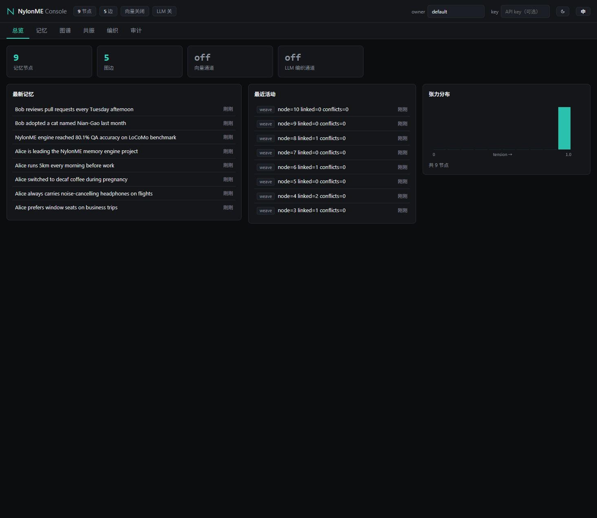

# NylonME — 尼龙记忆引擎

[English](README.md) | 简体中文

> 面向 AI Agent 的单机记忆引擎：记忆丝多维修织 · 网状记忆图 · 张力遗忘 · 情境共振
> 状态：Phase 2 活跃开发中（API 仍可能演进）

NylonME 把一条记忆建模为多股"丝"（事实/情感/时序/关系/置信/频次）的编织体，记忆节点之间以加权边构成网状图而非层级树。检索不是 top-k 相似度匹配，而是"情境共振"：从种子节点出发，按关联强度 × 情境匹配 × 实时张力在图上扩散激活，并受全局激活预算约束（防止高扇出节点扩散爆炸）。不使用的记忆会沿张力遗忘曲线自然沉降，而不是无限堆积。

## 评测成绩

LoCoMo 证据召回 recall@10，全量 10 会话语料（1536 个可答 QA，词面+向量融合检索）：

| 阶段 | recall@10 |
|---|---|
| 词面基线 | 47.1% |
| +向量种子（bge-m3）+图 | 70.6% |
| +双层写入（叶子层原文 + session 级 LLM 事实） | 79.2% |
| +自适应联想深度（Cat4 单跳查询不扩散） | 80.1% |
| +查询向量重排激活集 | 84.6% |
| +异步常识反思（世界知识桥接） | **85.4%** |

分类召回（全量）：多跳 82.6%、时序 89.4%、常识 63.0%、单跳 87.6%。

端到端问答（LLM 基于检索到的 Top-10 作答，裁判判定）：论文口径 **75.4%**（Mem0 Appendix A 措辞）、严格口径 **70.1%**。完整方法、分类表与方差说明见 [docs/LOCOMO_BENCHMARK.md](docs/LOCOMO_BENCHMARK.md)。

实验逼出来的两条设计铁律：**理解层在写入侧**（LLM 是记忆的编译器，把原始事件编译成可检索结构；查询侧 LLM 扩展实测净零），以及**两层必须共存**（只用抽象层检索会把分数拉到 67.3%）。

## 2 分钟接入你的 Agent（MCP）

`nylon-engine mcp` 以 stdio 方式讲 Model Context Protocol，引擎**内嵌在进程里**——不用起守护进程、不用开端口，数据自动落盘 `~/.nylonme/data`。从 [Releases](https://github.com/nylon-memory/NylonME/releases) 下载二进制，在 MCP 客户端配置里加一段：

```json
{
  "mcpServers": {
    "nylonme": {
      "command": "/path/to/nylon-engine",
      "args": ["mcp"],
      "env": { "NYLON_OWNER": "my-project" }
    }
  }
}
```

Claude Code、Cursor、Codex、VS Code Copilot 等所有 MCP 客户端通用。Agent 会获得三个工具：`memory_weave`（沉淀事实）、`memory_resonate`（回忆相关记忆）、`memory_get`（按 ID 读取）。各客户端的详细配置见 [docs/GETTING_STARTED.md](docs/GETTING_STARTED.md)。

多机共享一份记忆库时，可选**远程桥接模式**：设 `NYLON_SERVER=host:50051`（可选 `NYLON_API_KEY`），MCP 调用会转发到远端引擎，本机不再内嵌引擎。

### 为 DSH（DeepSeek Harness）开箱即用

仓库内置一个 DSH 插件，装上之后每个 DSH 会话自动获得长期记忆（会话开始自动共振回忆、结束自动编织入库，客户端零二进制）：

```bash
dsh plugin --profile web add <nylon/plugins/dsh-nylonme-memory>
```

见 [plugins/dsh-nylonme-memory/README.md](plugins/dsh-nylonme-memory/README.md)。

## 内置 Web 控制台

引擎二进制自带零安装 Web 控制台和 REST API（默认 `http://127.0.0.1:50052`，`NYLON_HTTP_ADDR=off` 关闭）：



浏览记忆（实时张力）、调试共振查询（种子、分数、自适应深度）、手工写入记忆——与 gRPC/MCP 同一个引擎、同一条写路径。REST 端点与 gRPC 契约一一对应，规范见 [docs/api/openapi.json](docs/api/openapi.json)。内置深色/浅色主题和中英文界面切换。

## 多租户与鉴权

引擎支持租户隔离（L2.1）与 API key 鉴权（L2.2），三档权限 read < write < admin：

- 未配置任何 key：开放模式（单机默认），行为与历史版本一致；
- 设 `NYLON_API_KEYS_FILE`（或内联 `NYLON_API_KEYS`）后启用鉴权：HTTP 请求带 `x-api-key` 头或 `Authorization: Bearer <key>`，gRPC 带 `x-api-key` metadata；
- 首次启动会生成一把 admin key 并打印一次；之后用 `nylon-engine keys add/list/revoke` 给同事发 key（key 表热加载，无需重启）。

审计事件流（L2.3）由 `NYLON_AUDIT` 开关控制，`GET /v1/audit` 查询谁在用、谁在刷。

## Python SDK

`nylon-sdk` 把 gRPC 契约封装成同步 + 异步客户端：

```bash
pip install ./sdk/python    # 从本仓库安装
```

```python
from nylon_sdk import NylonClient

with NylonClient("127.0.0.1:50051", owner="alice") as client:
    client.weave("Alice prefers window seats on business trips")
    for node in client.resonate("flight seat preference").activated:
        print(node.filaments.fact)
```

详见 [sdk/python/README.md](sdk/python/README.md)。

## 框架集成

LangChain 与 LlamaIndex 适配器在 [integrations/](integrations/README.md)：

```bash
pip install "nylonme-integrations[langchain]"   # 或 [llamaindex]
```

```python
from nylonme_integrations.langchain import NylonMeRetriever

retriever = NylonMeRetriever(target="127.0.0.1:50051", owner="alice")
docs = retriever.invoke("flight seat preference")
```

## 快速开始

### 用 Docker 一条命令跑起来（无需 Rust 工具链）

```bash
git clone https://github.com/nylon-memory/NylonME.git
cd NylonME
docker compose up -d
```

启动引擎 + ollama（自动拉取 `bge-m3` 嵌入模型）。随后打开 Web 控制台 http://localhost:50052 ——gRPC 在 :50051，REST/OpenAPI 在同一个 HTTP 端口。跳过本地构建直接拉预编译镜像：`docker compose -f docker-compose.prebuilt.yml up -d`。启用 LLM 编织层前先设好 `NYLON_LLM_API_KEY`（默认 DeepSeek）。

### 从源码构建

```bash
cd engine
cargo test                    # 运行全部单元测试
cargo run -p nylon-engine     # 运行自检演示
```

以 gRPC 守护进程方式运行（RocksDB 持久化）：

```bash
NYLON_DATA_DIR=./data \
NYLON_EMBED_URL=http://localhost:11434 NYLON_EMBED_MODEL=bge-m3 NYLON_EMBED_DIMS=1024 \
cargo run --release -p nylon-engine -- serve 0.0.0.0:50051
```

可选的理解层（session 级事实编织，任意 OpenAI 兼容端点）：

```bash
NYLON_LLM_URL=https://api.deepseek.com/v1/chat/completions \
NYLON_LLM_MODEL=deepseek-v4-flash NYLON_LLM_API_KEY=... NYLON_LLM_THINKING_OFF=1 ...
```

内置一个小 CLI 便于手工操作：

```bash
cargo run --release --example nylon_cli -- resonate --owner alice --query "机票是什么时候订的" --budget 8
cargo run --release --example nylon_cli -- weave --owner alice --fact "Alice 出差喜欢靠窗座位"
```

## 备份与恢复

RocksDB 支持周期快照 + WAL 截断（`NYLON_CHECKPOINT_SECS`，默认 600 秒），也可 `POST /v1/checkpoint` 手动触发，便于热备份。完整步骤见 [docs/BACKUP_RESTORE.md](docs/BACKUP_RESTORE.md)。

## 调参旋钮（环境变量）

| 变量 | 默认值 | 作用 |
|---|---|---|
| `NYLON_MAX_SEEDS` | 20 | 种子集大小上限（词面+向量双通道） |
| `NYLON_RERANK_VEC` | 0 | 查询向量余弦相似度混入共振排序的权重 |
| `NYLON_TENSION_FLOOR` | 0 | 排序时的张力下限（不改节点状态） |
| `NYLON_SEED_QUOTA` | 0 | 输出中给直接命中种子的保底前排名额 |
| `NYLON_DERIVED_EDGES` | 关 | 抽象层→叶子的显式边（实测对时序/常识负收益，保持关闭） |
| `NYLON_WORLD_BRIDGES` / `NYLON_WORLD_BRIDGES_ASYNC` | 关 | 常识世界知识桥接（同步 / 异步反思） |
| `NYLON_PERSONA_REFLECT` | 关 | 异步反思中的画像节点抽取 |
| `NYLON_REFLECT_IDLE_SECS` | — | 异步反思空闲触发间隔 |
| `NYLON_HTTP_ADDR` | 127.0.0.1:50052 | HTTP/UI 监听地址（`off` 关闭） |
| `NYLON_DATA_DIR` | ./nylon-data | RocksDB 数据目录 |
| `NYLON_CHECKPOINT_SECS` | 600 | 周期快照间隔（秒，0 关闭） |
| `NYLON_API_KEYS_FILE` / `NYLON_API_KEYS` | — | API key 表（文件路径或内联 JSON） |
| `NYLON_AUDIT` | 关 | 审计事件流开关 |
| `NYLON_SERVER` | — | MCP 远程桥接目标（`host:50051`） |
| `NYLON_API_KEY` | — | 客户端连远端引擎的 key（远程桥接/CLI） |
| `NYLON_OWNER` / `NYLON_TENANT` | default | MCP 缺省 owner / 租户 |

## 仓库结构

```
NylonME/
├── proto/            # nylon/v1 gRPC 契约（Weave / WeaveSession / Resonate / Search / GetNode）
├── engine/           # Rust workspace
│   └── crates/
│       ├── nylon-core    # 记忆丝数据模型 + 张力遗忘
│       ├── nylon-graph   # CSR 主图 + Delta 缓冲 + 共振遍历
│       ├── nylon-vector  # HNSW 向量索引
│       ├── nylon-embed   # 嵌入客户端（ollama / OpenAI 兼容）
│       ├── nylon-llm     # 理解层：事实编织、冲突检测
│       ├── nylon-storage # RocksDB 持久化（WAL + 快照，崩溃恢复）
│       ├── nylon-service # 服务端/移动端共享核心
│       └── nylon-engine  # 引擎入口 + gRPC 服务（tonic）
├── sdk/python/       # Python SDK（nylon-sdk）
├── integrations/     # LangChain / LlamaIndex 适配器
├── plugins/          # DSH 等 Agent 平台插件
├── docs/             # 指南与 API 规范
└── helm/             # Kubernetes 部署
```

## 路线图

已完成：双层写入引擎（WeaveSession）、词面+向量混合种子、自适应联想深度、查询向量重排、HNSW、RocksDB 持久化、gRPC 服务化、LoCoMo 85.4%、REST/OpenAPI 网关 + Web 控制台、Python SDK、LangChain/LlamaIndex 集成、租户隔离（L2.1）、API key 鉴权（L2.2）、审计事件流（L2.3）、周期快照与备份（L2.4）、Docker 一键部署、Helm chart、DSH 插件。
下一步：交叉编码器 reranker、百万节点内存 profiling、论文与博客系列。

## 贡献

欢迎贡献！提交 PR 前请阅读 [CONTRIBUTING.md](CONTRIBUTING.md)。
注意：本项目要求签署 CLA（贡献者许可协议），PR 提交后会有机器人引导签署。

## 许可证

[Apache License 2.0](LICENSE)。"NylonME" 名称与标识是项目商标，许可证不授权商标使用（见 [NOTICE](NOTICE)）。
